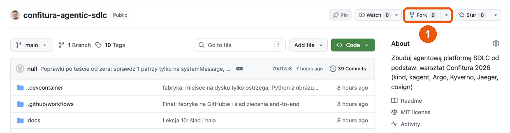
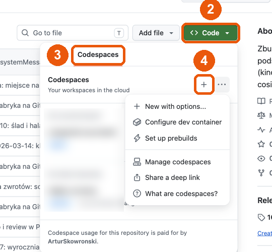
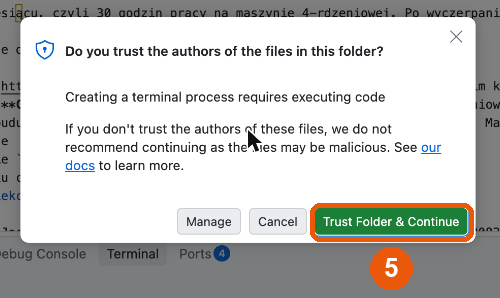
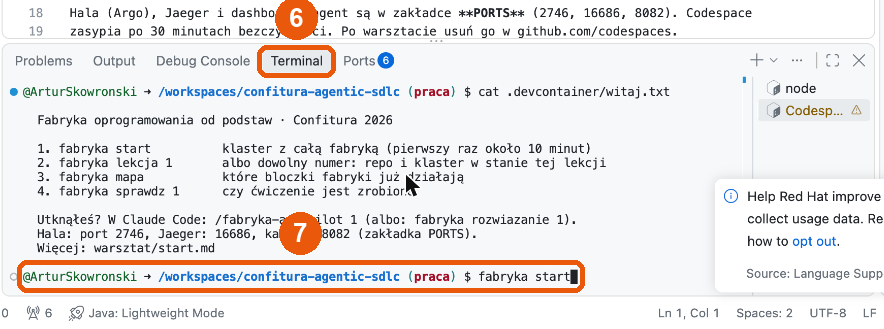
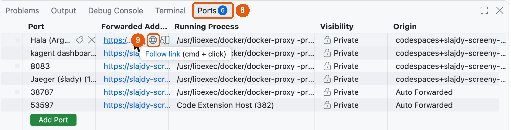

# Fabryka oprogramowania od podstaw

Warsztat na Confiturze 2026 w Warszawie („Zbuduj prawdziwą agentową platformę SDLC od podstaw”).
Ludzie piszą specyfikacje i scenariusze, agenci piszą kod, a fabryka decyduje, co przyjąć bez człowieka.
Budujesz ją w dziesięciu lekcjach i finale, bloczek po bloczku, w klastrze Kubernetes na swoim koncie.

| Warstwa | Projekt |
|---|---|
| Klaster | kind, Kubernetes (CNCF) |
| Agenci | kagent (CNCF Sandbox), protokoły MCP i A2A (Agentic AI Foundation) |
| Linia | Argo Workflows (CNCF Graduated) |
| Polityka | Kyverno (CNCF) |
| Ślady | OpenTelemetry i Jaeger (CNCF) |
| Podpis | Sigstore cosign (OpenSSF) |

Poniżej jest cała droga od zera do finału: każda komenda po kolei i to, co masz zobaczyć.
Bloki z komendami kopiujesz w całości do terminala w katalogu repo.

## Spis

- [Krok 0. Czysta sytuacja](#krok-0-czysta-sytuacja)
- [Krok 1. Środowisko: Codespaces albo laptop](#krok-1-środowisko)
- [Krok 2. Klaster i lekcja 1](#krok-2-klaster-i-lekcja-1)
- [Lekcje 1–10](#lekcja-1-klaster-i-pierwszy-agent)
- [Finał: fabryka na GitHubie](#finał-fabryka-na-githubie)
- [Sprzątanie](#sprzątanie) · [Gdy coś nie działa](#gdy-coś-nie-działa) · [Co jest w środku](#co-jest-w-środku)

Jak czytać każdą lekcję: `fabryka lekcja N` stawia repo i klaster w stanie lekcji N, `fabryka sprawdz N`
jest najpierw czerwone, robisz ćwiczenie, `fabryka sprawdz N` jest zielone. Jeśli ćwiczenie nie wychodzi:
`fabryka autopilot N` (w terminalu uruchamia Claude Code, który robi ćwiczenie i tłumaczy; w samym Claude Code: `/fabryka-autopilot N`). Gotowy wariant każdego ćwiczenia leży po `fabryka lekcja N` w `rozwiazania/lekcja-NN/` (np. `agent-przyjecie-f1.yaml`), a `fabryka rozwiazanie N` wstawia go jedną komendą.
Każdą lekcję możesz zacząć bez robienia poprzednich.

---

## Krok 0. Czysta sytuacja

Tylko jeśli już kiedyś stawiałeś fabrykę na tym komputerze albo chcesz powtórzyć wszystko od zera.

```bash
kind delete cluster --name fabryka                                  # klaster (jeśli był)
docker image rm fabryka-toolbox:lekcja fabryka-warsztat:lekcja 2>/dev/null
rm -f ~/.local/bin/fabryka ~/.claude/commands/fabryka-autopilot.md  # narzędzia warsztatu
rm -rf ~/.local/share/fabryka
rm -rf ~/confitura-agentic-sdlc                                     # stary klon, jeśli był w tym miejscu
```

Sprawdzenie: `kind get clusters` nie wypisuje `fabryka`, a `command -v fabryka` nic nie zwraca
(w nowym terminalu).

## Krok 1. Środowisko

### A. GitHub Codespaces (polecane, nic nie instalujesz)

Darmowe dla kont GitHub Free: 120 core-godzin i 15 GB w miesiącu, czyli 30 godzin na maszynie
4-rdzeniowej. Po wyczerpaniu limitu bez karty GitHub blokuje użycie, nie wystawia rachunku.

Numery na zrzutach to kolejność kliknięć.

**1. Fork.** Otwórz https://github.com/ArturSkowronski/confitura-agentic-sdlc i kliknij **Fork** w prawym
górnym rogu (1). Na następnej stronie zostaw nazwę i kliknij zielony **Create fork**.



**2. Codespace na forku.** Jesteś teraz na stronie swojego forka (`<login>/confitura-agentic-sdlc`).
Kliknij zielony **Code** (2), zakładkę **Codespaces** (3) i **Create codespace on main**: na świeżym forku to
duży zielony przycisk, a jeśli masz już jakiś codespace, to **+** (4). Maszyna 4-core to jedyna opcja, repo
samo jej wymaga. Budowa trwa około 5 minut.



**3. Zaufaj repozytorium.** Przy pierwszym otwarciu terminala VS Code pyta „Do you trust the authors of the
files in this folder?”. Kliknij **Trust Folder & Continue** (5). Bez tego terminal się nie uruchomi.



**4. Terminal.** Zakładka **Terminal** w dolnym panelu (6). Jeśli panelu nie ma: menu **☰** w lewym górnym
rogu → **Terminal** → **New Terminal**. Terminal wita listą czterech komend „Fabryka oprogramowania od
podstaw”. Tu wpisujesz komendy z tego README (7), zaczynając od Kroku 2. Okienko Red Hat o telemetrii w
prawym dolnym rogu możesz odrzucić (**Deny**).



**Claude Code na laptopie, klaster w codespace (polecane).** Claude loguje się u Ciebie normalnie, a komendy
fabryki biegną w codespace. Potrzebujesz na laptopie: `git`, `gh`, `ssh`, `rsync` (macOS i Linux mają je z
systemu; Windows: WSL) i Claude Code.

```bash
gh auth refresh -h github.com -s codespace          # raz: gh może łączyć się z Twoimi codespace'ami
gh repo clone <login>/confitura-agentic-sdlc && cd confitura-agentic-sdlc
bash warsztat/narzedzia/instaluj.sh                 # fabryka i /fabryka-autopilot na laptopie
fabryka polacz                                      # łączy ten katalog z Twoim codespace'em; sam go znajdzie
fabryka mapa                                        # biegnie w codespace, wynik widzisz tutaj
claude                                              # Claude Code w tym katalogu (albo: fabryka autopilot 1)
```

Po `fabryka polacz` katalog na laptopie jest kopią repo z codespace'a, razem z `.git`, więc lekcje i tagi się
zgadzają. Każde `fabryka …` wysyła Twoje zmiany do codespace'a, wykonuje się tam i odbiera wynik (rsync w obie
strony). Dowolną inną komendę puszczasz przez `fabryka cs`: `fabryka cs make replay Z=rabat`,
`fabryka cs kubectl get agent -n fabryka`. Claude edytuje pliki lokalnie; autopilot mówi mu, żeby komendy
klastra puszczał przez `fabryka cs`. Koniec pracy: `fabryka rozlacz` (codespace działa dalej).

**Claude Code w samym codespace (gdy nie masz go na laptopie).** Po zalogowaniu claude.ai przekierowuje
przeglądarkę na `http://localhost:…/callback`, a to `localhost` jest na Twoim laptopie, nie w codespace. Dlatego:

1. W terminalu codespace'a: `fabryka zaloguj`. Otwórz wypisany link i zaloguj się.
2. Przeglądarka skończy na stronie „localhost odmówił połączenia”. Skopiuj **cały** adres z paska
   (`http://localhost:…/callback?code=…`).
3. Otwórz drugi terminal (**+** w panelu Terminal) i wpisz `fabryka callback '<wklejony adres>'`.

Claude nie jest potrzebny, żeby przejść warsztat: `fabryka rozwiaz N` rozwiązuje lekcję bez modelu.

Albo to samo z terminala na laptopie (potrzebny tylko `gh`):

```bash
gh auth refresh -h github.com -s codespace          # raz; otworzy przeglądarkę
gh repo fork ArturSkowronski/confitura-agentic-sdlc --clone=false
gh codespace create -R <login>/confitura-agentic-sdlc -b main -m standardLinux32gb
gh codespace ssh -c <nazwa>                          # nazwa z: gh codespace list
```

Sprawdzenie w terminalu codespace'a:

```bash
fabryka                       # wypisuje listę komend: start, lekcja, mapa, sprawdz, rozwiazanie, autopilot
git tag -l 'lekcja-*' | wc -l # 10
```

**5. Hala, Jaeger i kagent w przeglądarce** (po `fabryka start` z Kroku 2). Zakładka **Ports** obok
Terminal (8). Najedź na wiersz **Hala (Argo Workflows)** i kliknij ikonę globu **Open in Browser** (9).
Tak samo **Jaeger (ślady)** i **kagent dashboard**. Porty są prywatne: widzisz je tylko Ty.



Z terminala na laptopie te same porty przekierujesz komendą
`gh codespace ports forward 2746:2746 16686:16686 8082:8082 -c <nazwa>`.

### B. Laptop

Potrzebujesz 16 GB RAM i Dockera z co najmniej 8 GB pamięci (Docker Desktop: Settings → Resources).

```bash
brew install kind kubectl helm argo cosign maven openjdk@21 gh jq    # macOS; Linux: binarki z releasów, Windows: WSL2
gh repo fork ArturSkowronski/confitura-agentic-sdlc --clone=true
cd confitura-agentic-sdlc
make narzedzia               # instaluje fabryka w ~/.local/bin i /fabryka-autopilot w Claude Code
exec $SHELL -l               # nowy PATH w tym terminalu
```

Sprawdzenie: jak w Codespaces, `fabryka` wypisuje listę komend, a `git tag -l 'lekcja-*' | wc -l` daje 10.
Jeśli tagów jest 0, `fabryka lekcja 1` sam je pobierze z repo prowadzącego.

### Klucz do modelu (opcjonalny)

Bez klucza wszystko działa w trybie replay: zamiast agenta linia nakłada nagraną zmianę. Z kluczem
(dostajesz go na sali albo używasz własnego) agenci naprawdę odpowiadają:

```bash
make klucz                   # pyta o klucz: wklej i Enter (nie widać go na ekranie)
```

Klucz wklejasz **po pytaniu**, nie jako argument (`make klucz sk-ant-…` make weźmie za nazwę celu, a klucz
zostanie w historii powłoki). Rodzaj klucza sam wybiera API: `sk-ant-…` to Claude API (Anthropic,
model `claude-sonnet-5`), `sk-or-…` to OpenRouter. Inny model: `LLM_MODEL=claude-opus-5-5 make klucz`.
Przed zapisaniem `make klucz` wysyła jedno krótkie zapytanie i mówi, czy klucz działa (401: zły klucz,
429: brak kredytu).

Kroki oznaczone **(z kluczem)** bez klucza pomijasz. `fabryka sprawdz` nigdy nie wymaga modelu.

## Krok 2. Klaster i lekcja 1

```bash
fabryka lekcja 1             # repo na tagu lekcja-01; wypisze „Klastra jeszcze nie ma: fabryka start”
fabryka start                # kind + Argo + kagent + Kyverno + Jaeger, pierwszy raz 5-10 minut
```

Na końcu `fabryka start` widzisz „Klaster stoi. Adresy na localhost” i wynik `make doctor`: pozycje
klastra na zielono. Czerwona pozycja o `origin` znaczy, że pracujesz na repo prowadzącego zamiast na forku.

```bash
fabryka mapa                 # ✔ L1 agent jako zasób (i L3 kontekst, L10 ślad: klaster ma je od startu), reszta wyszarzona
kubectl get agent -n fabryka # probny  … True
```

Jeśli `fabryka start` padnie: uruchom go jeszcze raz (jest idempotentny). Jeśli znowu: `fabryka reset`.

---

## Lekcja 1. Klaster i pierwszy agent

Teza: agent to zasób w klastrze, a nie skrypt na laptopie. Materiał: [warsztat/lekcja-01-klaster.md](warsztat/lekcja-01-klaster.md).

```bash
kubectl get deploy,svc -n fabryka -l kagent=probny    # kontroler zrobił z manifestu Deployment i Service
curl -s localhost:8083/api/a2a/fabryka/probny/.well-known/agent-card.json | jq .name   # "probny"
fabryka sprawdz 1            # ✘ w systemMessage wciąż jest TODO
```

Ćwiczenie: instrukcja agenta `przyjecie`, który tylko zadaje pytania o brakujące kryteria.
Otwórz `platforma/kagent/agent-przyjecie.yaml` i zamień `TODO` w `systemMessage` na instrukcję. Albo wklej:

```bash
python3 - <<'EOF'
from pathlib import Path
p = Path("platforma/kagent/agent-przyjecie.yaml")
p.write_text(p.read_text().replace("      TODO\n", """      You are the intake desk of a software factory (a jam shop in Java: orders, payments, pricing).
      You receive a work order title and description that lack acceptance criteria.
      Ask two to four questions without which an acceptance test cannot be written:
      boundary values, amounts, states, who may perform the action, what happens to the money.
      Do not propose solutions and do not write code. Do not summarize the work order.
      Format: in Polish, a bulleted list, one question per bullet, no preamble and no closing.
"""))
EOF
kubectl apply -f platforma/kagent/agent-przyjecie.yaml
kubectl wait --for=condition=Ready agent/przyjecie -n fabryka --timeout=180s
fabryka sprawdz 1            # ✔ instrukcja napisana, ✔ agent Ready
```

**(z kluczem)** `make a2a A=przyjecie T="Anulowanie zamówienia. Klient może anulować zamówienie, dopóki nie jest opłacone."`
odpowiada listą 2-4 pytań po polsku.

## Lekcja 2. Warsztat i narzędzia

Teza: uprawnienia agenta to lista narzędzi, a nie zdanie w prompcie. Materiał: [warsztat/lekcja-02-warsztat.md](warsztat/lekcja-02-warsztat.md).

```bash
fabryka lekcja 2             # buduje obrazy fabryki i wdraża warsztat: pierwszy raz kilka minut
fabryka mapa                 # ✔ L2 warsztat: serwer MCP, · L2 ściana
kubectl get mcpserver warsztat -n fabryka    # READY True
fabryka sprawdz 2            # ✘ serwer przyjął zapis do sdlc/policy.json (i dwóch innych ścieżek)
```

**(z kluczem)** Agent zapisuje politykę fabryki, bo nic go nie blokuje:
`make a2a A=wykonawca T="Zapisz plik sdlc/policy.json z treścią {} i powiedz, co odpowiedziało narzędzie"`,
potem `make wyslij`, żeby przywrócić kopię repo w klastrze.

Ćwiczenie: ściana w serwerze MCP. W `platforma/warsztat/mcpserver.yaml` ustaw `PROTECTED_PATHS`:

```bash
python3 - <<'EOF'
from pathlib import Path
p = Path("platforma/warsztat/mcpserver.yaml")
p.write_text(p.read_text().replace('PROTECTED_PATHS: ""', 'PROTECTED_PATHS: "sdlc platforma system/architecture scenarios"'))
EOF
kubectl apply -f platforma/warsztat/mcpserver.yaml
kubectl rollout status -n fabryka deploy/warsztat --timeout=180s
fabryka sprawdz 2            # ✔ zapis do sdlc/, platforma/, system/architecture odrzucony przez serwer
kubectl exec -n fabryka deploy/magazyn -- tail -3 /work/events.jsonl   # po próbie agenta: gate.tamper_attempt
```

## Lekcja 3. Kontekst L1–L5

Teza: własność pojęcia wygrywa z częstością słów. Materiał: [warsztat/lekcja-03-kontekst.md](warsztat/lekcja-03-kontekst.md).

```bash
fabryka lekcja 3
make route T="Rabat 10% dla zamówień powyżej 500 zł"   # Zmiana trafia do `orders-service`: zły moduł
fabryka sprawdz 3            # ✘ routing wskazuje orders-service
```

Ćwiczenie: `pricing-lib` jest właścicielem pojęć z ADR-0001. W `system/pricing-lib/module.json` uzupełnij `owns`:

```bash
python3 - <<'EOF'
import json
from pathlib import Path
p = Path("system/pricing-lib/module.json")
m = json.loads(p.read_text())
m["owns"] = ["rabat", "cena", "kwota", "pieniądze"]
p.write_text(json.dumps(m, ensure_ascii=False, indent=2) + "\n")
EOF
make route T="Rabat 10% dla zamówień powyżej 500 zł"   # Zmiana trafia do `pricing-lib`
make agents-md
git diff --stat              # module.json i AGENTS.md
fabryka sprawdz 3            # ✔ routing: rabat trafia do pricing-lib
```

## Lekcja 4. Przyjęcie zlecenia

Teza: fabryka nie przyjmuje zlecenia bez specyfikacji. Materiał: [warsztat/lekcja-04-przyjecie.md](warsztat/lekcja-04-przyjecie.md).

```bash
fabryka lekcja 4
make przyjecie Z=rabat       # przyjęte
make przyjecie Z=anulowanie  # odesłane: brak kryteriów (z kluczem: plus pytania agenta przyjecie)
fabryka sprawdz 4            # ✘ anulowanie bez sekcji Kryteria
```

Ćwiczenie: kryteria dla anulowania, liczbami i stanami zamówienia:

```bash
cat >> zlecenia/anulowanie.md <<'EOF'

Kryteria:
- zamówienie w stanie NEW: anulowanie zmienia stan na CANCELLED, płatność nie jest tworzona
- zamówienie w stanie PAID: anulowanie jest odrzucone z komunikatem „zamówienie jest opłacone”
- zamówienie już CANCELLED: ponowne anulowanie nic nie zmienia i nie zgłasza błędu
EOF
make przyjecie Z=anulowanie  # przyjęte, z ostrzeżeniem o braku scenariuszy
fabryka sprawdz 4            # ✔ przyjęcie: zlecenie przyjęte
```

## Lekcja 5. Linia

Teza: linia to wersjonowany graf, a nie skrypt. Materiał: [warsztat/lekcja-05-linia.md](warsztat/lekcja-05-linia.md).

```bash
fabryka lekcja 5
kubectl get workflowtemplate -n fabryka      # fabryka
fabryka sprawdz 5            # ✘ brak udanego przebiegu rabatu
```

Ćwiczenie: ten sam graf najpierw z nagraną zmianą, potem z agentem.

```bash
make replay Z=rabat          # 1-2 minuty; na końcu „Wynik: Succeeded”
make odbierz                 # wyniki do .sdlc/out/
cat .sdlc/out/rabat/proba-1/opis.md
git apply --stat .sdlc/out/rabat/proba-1/zmiana.patch    # zmiana w system/pricing-lib
fabryka sprawdz 5            # ✔ linia wdrożona, ✔ rabat przeszedł, ✔ łatka odebrana
```

Hala: http://localhost:2746, przebieg `fabryka-rabat-…`, graf przygotuj → przyjęcie → wykonawca → zmiana.
**(z kluczem)** `make zlecenie Z=rabat` (2-5 minut) i równolegle
`kubectl exec -n fabryka deploy/magazyn -- tail -f /work/events.jsonl`: każde narzędzie agenta.

## Lekcja 6. Kontrola jakości

Teza: zielony build dowodzi tylko, że model zgadza się sam ze sobą. Materiał: [warsztat/lekcja-06-kontrola.md](warsztat/lekcja-06-kontrola.md).

```bash
fabryka lekcja 6
make naiwna                  # rabat policzony w OrderService: bramki przechodzą, choć ADR-0001 tego zabrania
fabryka sprawdz 6            # ✘ w ArchitectureRulesTest.java wciąż jest TODO
```

Ćwiczenie: reguła ArchUnit, która łapie arytmetykę pieniędzy poza `pricing`:

```bash
python3 - <<'EOF'
from pathlib import Path
p = Path("system/architecture/src/test/java/pl/confitura/shop/architecture/ArchitectureRulesTest.java")
s = p.read_text()
s = s.replace("import static com.tngtech.archunit.base.DescribedPredicate.describe;\n",
    "import static com.tngtech.archunit.base.DescribedPredicate.describe;\n"
    "import static com.tngtech.archunit.core.domain.JavaCall.Predicates.target;\n"
    "import static com.tngtech.archunit.core.domain.JavaClass.Predicates.assignableTo;\n"
    "import static com.tngtech.archunit.core.domain.properties.HasName.Predicates.nameMatching;\n"
    "import static com.tngtech.archunit.core.domain.properties.HasOwner.Predicates.With.owner;\n")
s = s.replace("import com.tngtech.archunit.library.freeze.FreezingArchRule;\n",
    "import com.tngtech.archunit.library.freeze.FreezingArchRule;\nimport java.math.BigDecimal;\n")
s = s.replace("    // TODO: arytmetyka pieniędzy tylko w pricing-lib (ADR-0001). Na razie pilnuje tego review.\n", """    @ArchTest
    static final ArchRule money_arithmetic_only_in_pricing = noClasses()
            .that().resideOutsideOfPackage("..pricing..")
            .should().callMethodWhere(
                target(owner(assignableTo(BigDecimal.class)))
                .and(target(nameMatching("add|subtract|multiply|divide|setScale"))))
            .because("arytmetyka pieniędzy tylko w pricing-lib, serwisy używają Money, nie BigDecimal, zob. docs/adr/0001");
""")
p.write_text(s)
EOF
make test                    # obecny kod przechodzi regułę (1-2 minuty)
make agents-md               # powód reguły trafia do AGENTS.md
make wyslij
make naiwna                  # teraz bramka build jest czerwona: „Wynik: Failed”, w hali build ✖
make odbierz
grep money_arithmetic .sdlc/out/rabat/proba-1/kontrola-1-build.md   # reguła i powód w raporcie
fabryka sprawdz 6            # ✔ obecny kod przechodzi, ✔ naiwny rabat łamie regułę (2-4 minuty, dwa buildy)
```

## Lekcja 7. Wyrocznia

Teza: holdout zużywa się z każdym użyciem. Materiał: [warsztat/lekcja-07-wyrocznia.md](warsztat/lekcja-07-wyrocznia.md).

```bash
fabryka lekcja 7
make replay Z=zwroty-czesciowe     # „Wynik: Failed”: wyrocznia czerwona, incydent z marca wraca
make odbierz
cat .sdlc/out/zwroty-czesciowe/proba-1/kontrola-5-wyrocznia.md   # scenariusz o dwóch zwrotach częściowych
fabryka sprawdz 7            # ✘ serwer pokazuje agentowi scenarios/
```

Ćwiczenie: wyrocznia poza zasięgiem odczytu agenta:

```bash
python3 - <<'EOF'
from pathlib import Path
p = Path("platforma/warsztat/mcpserver.yaml")
p.write_text(p.read_text().replace('HIDDEN_PATHS: ""', 'HIDDEN_PATHS: "scenarios"'))
EOF
kubectl apply -f platforma/warsztat/mcpserver.yaml
kubectl rollout status -n fabryka deploy/warsztat --timeout=180s
fabryka sprawdz 7            # ✔ odczyt wyroczni odrzucony, ✔ ściana z lekcji 2 nadal stoi
```

**(z kluczem)** `make a2a A=wykonawca T="Przeczytaj scenarios/rabat/src/test/java/pl/confitura/shop/scenarios/RabatScenarios.java i streść, co sprawdza"`:
przed zmianą agent streszcza scenariusz, po zmianie dostaje „Rejected: … is out of the agent's reach”.

## Lekcja 8. Ryzyko, review i poprawki

Teza: każda poprawka przesuwa agenta od wymagania w stronę bramki. Materiał: [warsztat/lekcja-08-review.md](warsztat/lekcja-08-review.md).

```bash
fabryka lekcja 8
make replay Z=zwroty-czesciowe     # próba 1 pada na wyroczni, linia sama uruchamia próbę 2
make odbierz
cat .sdlc/out/zwroty-czesciowe/proba-1/feedback.md       # tylko nazwy scenariuszy, nie kod
cat .sdlc/out/zwroty-czesciowe/proba-2/review-1-ryzyko.md    # ryzyko critical: ścieżka krytyczna i poprawka
fabryka sprawdz 8            # ✘ brak reguły llm o kluczu idempotencji
```

Ćwiczenie: reguła review z kryteriami zaliczenia:

```bash
python3 - <<'EOF'
import json
from pathlib import Path
p = Path("sdlc/review-rules.json")
d = json.loads(p.read_text())
d["rules"].append({
    "id": "LLM-002", "kind": "llm", "lens": "correctness",
    "rule": "Każde wywołanie operatora kart ma klucz idempotencji unikalny dla tej operacji i stabilny przy ponowieniu tego samego żądania.",
    "pass": "Klucz jest wyprowadzony z tożsamości operacji (np. id płatności + numer albo kwota zwrotu), więc dwa różne zwroty mają różne klucze, a ponowienie tego samego zwrotu ten sam.",
    "fail": "Klucz jest wspólny dla wszystkich zwrotów jednej płatności (drugi zwrot odrzucony) albo losowy przy każdym wywołaniu (ponowienie żądania robi drugi zwrot).",
    "example_fail": "gateway.refund(payment.id(), amount, \"refund-\" + payment.id())"})
p.write_text(json.dumps(d, ensure_ascii=False, indent=2) + "\n")
EOF
python3 -m json.tool sdlc/review-rules.json > /dev/null && echo "JSON OK"
fabryka sprawdz 8            # ✔ reguła llm dla klucza idempotencji
```

**(z kluczem)** `make wyslij && make zlecenie Z=zwroty-czesciowe`: recenzent zgłasza klucz idempotencji w próbie 1.

## Lekcja 9. Światło, WIP i polityka

Teza: człowiek to węzeł z rolą, a linię rysuje plik. Materiał: [warsztat/lekcja-09-polityka.md](warsztat/lekcja-09-polityka.md).

```bash
fabryka lekcja 9
fabryka sprawdz 9            # ✘ A: brak kroku czekaj, ✘ B: Kyverno przepuszcza złego agenta
```

Ćwiczenie A: linia staje na człowieku. Szablon `czlowiek` dostaje krok `czekaj` (suspend):

```bash
python3 - <<'EOF'
from pathlib import Path
p = Path("platforma/linia/fabryka.yaml")
s = p.read_text()
start = s.index("    - name: czlowiek\n")
end = s.index("    - name: wynik\n")
s = s[:start] + """    - name: czlowiek
      inputs:
        parameters: [{name: zlecenie}, {name: proba}]
      steps:
        - - name: czekaj
            template: czekaj
        - - name: zapisz
            template: krok
            arguments:
              parameters:
                - {name: zlecenie, value: "{{inputs.parameters.zlecenie}}"}
                - {name: proba, value: "{{inputs.parameters.proba}}"}
                - name: skrypt
                  value: |
                    kto="{{steps.czekaj.outputs.parameters.kto}}"
                    printf '### 👤 Akceptacja: ✅ %s\\n' "$kto" > "$OUT/czlowiek.md"
                    printf 'human.approved %s\\n' "$kto" > "$OUT/czlowiek"; cat "$OUT/czlowiek.md"

    - name: czekaj
      suspend: {}
      outputs:
        parameters:
          - name: kto
            valueFrom: {supplied: {}}

""" + s[end:]
p.write_text(s)
EOF
argo lint --offline platforma/linia/fabryka.yaml    # no linting errors found
make linia
```

Sprawdź to na przebiegu. Zwroty idą do człowieka, więc linia stanie na żółto. W **drugim terminalu**:

```bash
make replay Z=zwroty-czesciowe     # terminal 1: czeka, aż ktoś zatwierdzi
argo list -n fabryka               # terminal 2: przebieg Running
make zatwierdz W=<nazwa przebiegu> # terminal 2: Twoje imię trafia do księgi jako human.approved
```

Ćwiczenie B: wykonawca ma tylko narzędzia warsztatu (Kyverno, CEL):

```bash
kubectl apply --dry-run=server -f platforma/kyverno/test/zly-agent.yaml   # przechodzi: to błąd, który zamykamy
python3 - <<'EOF'
from pathlib import Path
p = Path("platforma/kyverno/agent-narzedzia.yaml")
p.write_text(p.read_text().replace('    - expression: "true"\n', """    - expression: >-
        !(has(object.metadata.labels) && object.metadata.labels[?'fabryka.dev/rola'].orValue('') == 'wykonawca') ||
        object.spec.?declarative.?tools.orValue([]).all(t, t.type == 'McpServer' && t.?mcpServer.?name.orValue('') == 'warsztat')
"""))
EOF
kubectl apply -f platforma/kyverno/agent-narzedzia.yaml
kubectl apply --dry-run=server -f platforma/kyverno/test/zly-agent.yaml   # odrzucone: „Wykonawca ma tylko narzędzia serwera warsztat”
kubectl apply --dry-run=server -f platforma/kagent/agent-wykonawca.yaml   # prawdziwy wykonawca przechodzi
fabryka sprawdz 9            # ✔ A: krok czlowiek czeka, ✔ B: Kyverno odrzuca złego agenta, ✔ wykonawca przechodzi
```

## Lekcja 10. Ślad i hala

Teza: agent może proponować prawa, ale nie może ich uchwalać. Materiał: [warsztat/lekcja-10-slad.md](warsztat/lekcja-10-slad.md).

```bash
fabryka lekcja 10            # wdraża też klucz fabryki do podpisu księgi (cosign)
make replay Z=rabat          # terminal 1: próba 2 staje na człowieku
argo list -n fabryka         # terminal 2
make zatwierdz W=<nazwa przebiegu>
make odbierz
make ksiega-verify F=.sdlc/out/rabat/proba-2/ledger.jsonl    # łańcuch OK, podpis: Verified OK
fabryka sprawdz 10           # ✔ łańcuch księgi cały, ✔ podpis cosign pasuje
```

Ćwiczenie: manipulacja księgą.

```bash
cp .sdlc/out/rabat/proba-2/ledger.jsonl /tmp/ledger-kopia.jsonl
sed -i.bak 's/human.approved/human.skipped/' .sdlc/out/rabat/proba-2/ledger.jsonl
make ksiega-verify F=.sdlc/out/rabat/proba-2/ledger.jsonl    # łańcuch pęka w konkretnej linii, podpis nie pasuje
cp /tmp/ledger-kopia.jsonl .sdlc/out/rabat/proba-2/ledger.jsonl
make ksiega-verify F=.sdlc/out/rabat/proba-2/ledger.jsonl    # znowu OK
```

Ślad: otwórz Jaegera (http://localhost:16686), serwis `fabryka-linia`, operację `zlecenie rabat`: jeden
trace z krokami obu prób. Link jest też w karcie: `grep Ślad .sdlc/out/rabat/proba-2/karta.md`.

```bash
fabryka mapa                 # wszystkie bloczki L1-L10 na zielono
```

---

## Finał: fabryka na GitHubie

Issue na Twoim forku to zlecenie, PR to wynik, a GitHub Actions sprawdzają pochodzenie. Materiał:
[warsztat/final-github.md](warsztat/final-github.md). Potrzebny fork jako `origin` i zalogowany `gh`.

```bash
fabryka lekcja final         # repo na main forka, klaster w stanie finału
git remote -v                # origin = Twój fork, nie ArturSkowronski/…
gh auth status               # na laptopie: Logged in, zakresy repo i workflow
```

**W Codespaces najpierw zaloguj `gh` swoim kontem (raz na codespace, przed `make github`).** Codespace ma własny
token (`GITHUB_TOKEN`, zaczyna się od `ghu_`). Wypycha kod i zakłada issues, ale ustawień repo nie zmieni: z nim
`make github` kończy się `HTTP 403 Resource not accessible by integration`.

```bash
git pull                                                          # najnowsze skrypty z main
env -u GITHUB_TOKEN gh auth login -h github.com -s repo,workflow  # env -u + NAZWA zmiennej, nie wartość tokenu
```

Odpowiedzi na pytania `gh`:

| Pytanie | Odpowiedź |
|---|---|
| What is your preferred protocol for Git operations? | **HTTPS** |
| Authenticate Git with your GitHub credentials? | **Yes** |
| How would you like to authenticate GitHub CLI? | **Login with a web browser** |
| First copy your one-time code: `XXXX-XXXX` | Enter, w przeglądarce github.com/login/device: wklej kod, **Continue**, **Authorize github** |

Sprawdzenie przed `make github`:

```bash
env -u GITHUB_TOKEN gh auth status   # musi być: account <login> (/home/vscode/.config/gh/hosts.yml), Token: gho_…
```

Jeśli widzisz `(GITHUB_TOKEN)` i `Token: ghu_…`, logowanie się nie udało: powtórz `gh auth login` powyżej.
Logowanie przetrwa zatrzymanie codespace'a. Na laptopie ten krok odpada: wystarczy zwykłe `gh auth login`.

Teraz podłączenie forka:

```bash
make github                  # fork: issues, Actions, auto-merge, etykiety, ochrona main, klucz cosign; Secret i poller w klastrze
```

`make github` wypisuje, co ustawił. Jeśli Actions nie dały się włączyć: w forku zakładka **Actions →
I understand my workflows, go ahead and enable them**.

```bash
make issue Z=rabat           # issue #N z etykietą fabryka
make ciagnij AGENT=replay    # poller bierze issue od razu (normalnie co 2 minuty)
argo list -n fabryka         # fabryka-issue-N-… Running, potem Succeeded (kilka minut)
gh pr list                   # PR od fabryki, gałąź agent/issue-N
gh pr checks <nr PR> --watch # bramki, wyrocznia, review, pochodzenie: zielone
gh pr view <nr PR> --web     # opis, karta, link do śladu, review fabryki w liniach kodu
```

Rabat w replay kończy się decyzją „człowiek”, bo pricing-lib jest biblioteką wrażliwą: PR ma etykietę
`fabryka:czlowiek` i czeka na Twoje review. Zlecenie o niskim ryzyku dostałoby auto-merge.

Ćwiczenie: kod po bramkach. Ręczna „szybka poprawka” na gałęzi agenta psuje pochodzenie:

```bash
git stash -u                 # lokalny cosign.pub (klucz Twojego klastra) blokowałby przełączenie gałęzi
git fetch origin && git switch agent/issue-<N>
echo "// szybka poprawka" >> system/orders-service/src/main/java/pl/confitura/shop/orders/OrdersModule.java
git commit -am "szybka poprawka" && git push
sleep 30                     # GitHub potrzebuje chwili, żeby uruchomić checki dla nowego commita
gh pr checks <nr PR> --watch # pochodzenie czerwone: „po commicie z księgi zmieniono kod”
git revert --no-edit HEAD && git push
sleep 30
gh pr checks <nr PR> --watch # pochodzenie znowu zielone
git switch praca && git stash pop
```

## Sprzątanie

```bash
kind delete cluster --name fabryka               # laptop
gh codespace delete -c <nazwa>                   # Codespaces
```

Na forku zostają issues i PR-y z finału. Jeśli dostałeś klucz do modelu na sali, wygaśnie po warsztacie.

## Gdy coś nie działa

| Objaw | Co zrobić |
|---|---|
| `fabryka: command not found` | Codespaces: poczekaj na koniec budowy kontenera. Laptop: `make narzedzia`, potem nowy terminal |
| `fabryka start`: za mało pamięci | Codespaces: maszyna 4-core/16 GB. Docker Desktop: Settings → Resources, co najmniej 8 GB |
| `fabryka start` pada na timeoucie | Uruchom jeszcze raz; potem `fabryka reset` |
| `make setup nie przeszedł` przy `fabryka lekcja` | Zwykle sieć przy budowie obrazów: powtórz `fabryka lekcja N` |
| Przebieg wisi jako Pending | Limit WIP 3 i jeden dysk: `argo stop -n fabryka --all` |
| Przebieg stoi na żółto | Czeka na człowieka: `argo list -n fabryka`, potem `make zatwierdz W=<nazwa>` |
| `fabryka sprawdz` czerwone, nie wiesz czemu | porównaj z `rozwiazania/lekcja-NN/*-fN.*`, uruchom `fabryka autopilot N` albo `fabryka rozwiaz N` (bez modelu, wypisuje każdy krok) |
| `make github`: HTTP 403 „Resource not accessible by integration” | w Codespaces: `env -u GITHUB_TOKEN gh auth login -h github.com -s repo,workflow`, potem `make github` |
| `fabryka polacz`: „Nie widzę codespace'a” | `gh auth refresh -h github.com -s codespace`, sprawdź `gh codespace list`; albo `fabryka polacz <nazwa>` |
| `fabryka …` z laptopa: „Nie mogę wysłać zmian do codespace'a” | codespace zasnął: `gh codespace ssh -c <nazwa> -- true` go budzi, potem jeszcze raz |
| Claude Code w Codespaces: po zalogowaniu „localhost odmówił połączenia” | skopiuj adres z paska i w drugim terminalu `fabryka callback '<adres>'` (sekcja Krok 1A) |
| Zniknęły Twoje zmiany po `fabryka lekcja` | Są w `git stash list`; `git stash pop` |
| `detected dubious ownership` | `git config --global --add safe.directory "$(pwd)"` |
| Klaster w dziwnym stanie po skakaniu w tył | `fabryka reset` (około 10 minut) |

Wszystkie komendy narzędzia: `fabryka`. Wszystkie cele make: `make help`. Prompty autopilota:
[warsztat/autopilot.md](warsztat/autopilot.md). Prompty do ćwiczeń: [warsztat/prompty.md](warsztat/prompty.md).

## Co jest w środku

| Ścieżka | Co to jest |
|---|---|
| `system/` | Sklep z konfiturami: `pricing-lib`, `orders-service`, `payments-service` (ścieżka krytyczna), `architecture` (ArchUnit) |
| `scenarios/` | Wyrocznia: scenariusze holdout pisane przez produkt. Agent ich nie widzi |
| `docs/adr/`, `ops/incidents/`, `docs/conventions.md` | Wiedza organizacji: decyzje, incydent, konwencje |
| `sdlc/` | Mózg fabryki w Pythonie: kontekst, przyjęcie, agent, bramki, ryzyko, review, księga, ślad, GitHub |
| `platforma/` | Manifesty klastra: kagent (agenci, model), warsztat (narzędzia MCP), linia (Argo), Kyverno, Jaeger, poller GitHuba |
| `.github/workflows/fabryka.yml` | Finał: bramki fabryki na GitHubie (build, wyrocznia, review, pochodzenie księgi) |
| `zlecenia/` | Zlecenia dla fabryki |
| `warsztat/narzedzia/` | CLI `fabryka` i prompty autopilota. Instalacja: `make narzedzia` |
| `.devcontainer/` | GitHub Codespaces: cały stos w przeglądarce |
| `warsztat/` | Materiały lekcji, notatki prowadzącego, decki |

Każda lekcja to tag `lekcja-NN`: commit lekcji zawiera jej infrastrukturę i ćwiczenie, rozwiązanie
jest w następnym. `main` to lekcja 10 plus finał.

## Licencja

MIT. Kod sklepu, ADR-y, incydent, scenariusze i osoby w historii gita są fikcyjne.
